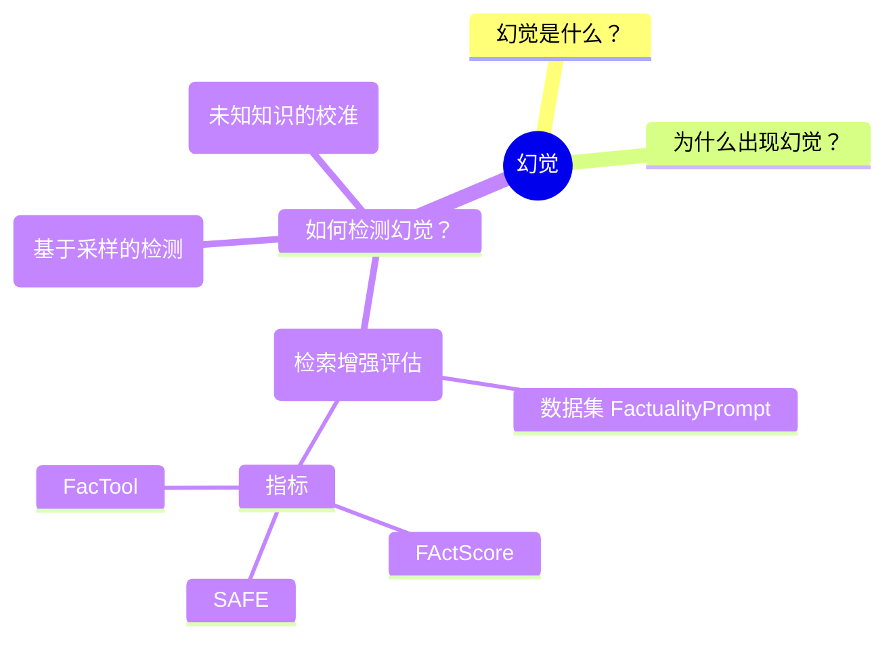
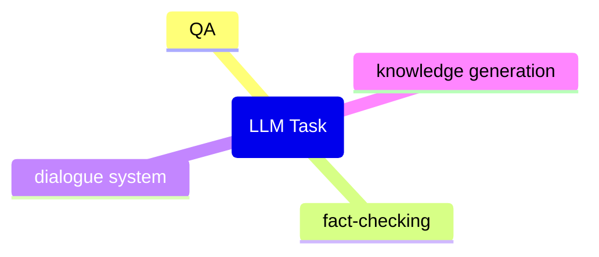
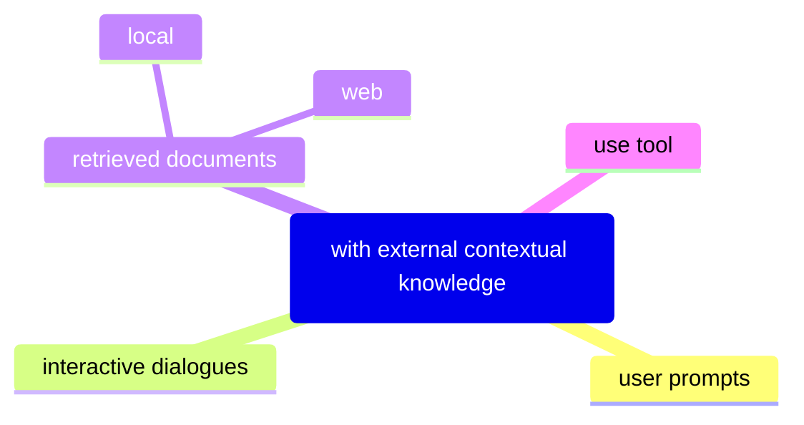

## 幻觉是什么？

模型输出是捏造的,而不是以所提供的上下文或世界知识为基础的情况。

上下文中幻觉：模型输出应与上下文中的源内容一致。
外在幻觉：当模型不知道一个事实时，它应该说不知道。

## 为什么出现幻觉？

预训练数据，过时、丢失或不正确

微调使用的新数据跟预训练数据不相容

## 如何检测幻觉？

### 检索增强评估
 

基准数据集 FactualityPrompt

幻觉的评估指标：

1. 幻觉 NE（命名实体）错误：使用预训练实体检测模型和文档级接地，此指标测量未出现在真实文档中的检测到的命名实体的比例。
2. 蕴涵比率：使用在MNLI和句子级知识基础上微调的RoBERTa模型，该指标计算了由蕴涵模型标记为与配对的维基百科句子相关的生成句子的比例。

FActScore 原子度评分中的事实精度

SAFE（Search-Augmented Factuality Evaluator

FacTool

### 基于采样的检测

SelfCheckGPT

### 未知知识的校准

提示模型生成对无法回答或未知问题的回答可能会引发幻觉

基准:

TruthfulQA

SelfAware

### 间接查询

直接查询要求模型判断生成的引用是否存在。间接查询则要求生成的引用提供辅助详细信息.

间接查询方法效果更好，模型越大，幻觉越少。

衡量幻觉的方法在自然语言生成（NLG）中是一个重要的研究领域。以下是一些主要的衡量幻觉的方法，这些方法在论文中被详细讨论：

## 幻觉评估指标

### 1. **统计指标（Statistical Metrics）**
- **PARENT**：通过计算生成文本和参考文本之间的n-gram重叠来衡量生成文本的准确性。PARENT-T是PARENT的一个变体，它只使用表格内容作为参考。
- **Knowledge F1 (KF1)**：用于知识引导的对话任务，衡量模型生成的文本与知识库中的内容重叠。

### 2. **基于模型的指标（Model-based Metrics）**
- **信息提取（IE）基础指标**：使用信息提取模型将知识表示为关系元组（如主体、关系、对象），然后与源/参考中提取的关系元组进行比较。
- **问答（QA）基础指标**：通过生成问题并回答这些问题来衡量生成文本与源文本的知识重叠或一致性。
- **自然语言推理（NLI）指标**：使用NLI模型来衡量生成文本与源文本之间的逻辑一致性。
- **语言模型（LM）基础指标**：利用两个语言模型（一个仅在目标上训练，另一个在源和目标上训练）来确定每个标记是否得到支持。

### 3. **人类评估（Human Evaluation）**
- **评分**：人类注释者在一定范围内对幻觉水平进行评分。
- **比较**：人类注释者将输出文本与基线或真实参考进行比较。

### 4. **特定任务的指标**
- **摘要生成**：使用如FEQA、QAGS和QuestEval等QA基础指标来衡量摘要与源文档的知识重叠。
- **对话生成**：使用知识F1（KF1）和Rare F1（RF1）等变体来衡量生成响应与知识句子的重叠。
- **生成式问答（GQA）**：使用如语义重叠、事实一致性等指标来衡量生成答案的事实正确性。

### 5. **半监督指标（Semi-Supervised Metrics）**
- **FactCC**：一个弱监督模型，用于评估摘要的事实一致性。
- **BERTScore**：用于衡量生成答案与参考答案之间的相似性。

### 6. **未来方向**
- **细粒度指标**：开发能够区分内在和外在幻觉的细粒度指标。
- **事实检查**：自动化事实检查系统用于外在幻觉验证。
- **泛化性**：开发跨领域的任务不可知指标，以评估幻觉。

## 大型语言模型（LLMs）中，幻觉

### 13.1 LLMs中的幻觉定义
- 在LLMs的背景下，幻觉的定义比以往更广泛，因为训练数据的广泛性和知识库的深度。
- 幻觉不仅表示与源输入的偏离，还扩展到与训练数据的偏离，更多地倾向于外在类型。
- 训练数据通常被假设为一致的事实，但这种假设并不总是有效的，因为训练数据集可能包含非事实性和矛盾的信息。

### 13.2 LLMs的幻觉指标
- 这些指标旨在衡量LLM生成内容中的幻觉水平或量化个别LLM的幻觉风险。
- 根据是否需要黄金参考来识别幻觉，将现有的幻觉指标分为依赖参考的和不依赖参考的。

#### 13.2.1 依赖参考的指标
- **人类注释的幻觉基准**：通过收集人类验证的QA样本来测试LLMs的事实知识。
- **自动化幻觉基准测试**：自动生成基准测试方法，包括自动基准生成和自动证据检索。

#### 13.2.2 不依赖参考的指标
- **基于不确定性的幻觉检测**：假设LLMs为它们确信的标记分配高概率，为不确定的标记分配低概率。
- **基于一致性的幻觉检测**：评估LLM生成的多个补全的一致性。

### 13.3 LLMs中的幻觉缓解
- **数据相关的缓解方法**：包括在预训练阶段使用高质量数据，以及在指令调整和奖励模型训练中使用精选数据。
- **建模和推理方法**：包括安全微调、人类反馈的强化学习（RLHF）、模型编辑、解码方法、思维链及其变体、后处理和集成。

### 13.4 LLMs幻觉缓解的未来方向
- **大型多模态模型中的幻觉**：需要更深入地分析图像，而不仅仅是表面级别的识别。
- **长尾和低资源领域的幻觉**：需要设计统一的框架和可推广的策略来应对各种不平衡场景中的幻觉。
- **估计知识边界和表达不确定性**：教会模型准确建模它们的知识边界，并诚实地表达“我不知道”。
- **最小化幻觉缓解过程中的对齐税**：探索策略以最小化幻觉缓解过程中的成本，防止LLMs变得过于保守或遭受灾难性遗忘。
- **理解LLMs中的幻觉**：尽管研究社区已经投入了大量努力开发用于衡量和缓解幻觉的实证方法，但我们对LLM幻觉的理解仍然有限。

## Knowledge Conflicts for LLMs: A Survey

**使用外部知识**：

    优点：及时了解当前信息，生成精确答案
    缺点：由于丰富的知识来源，它有可能产生冲突

**知识冲突**：上下文知识和模型的参数知识之间的差异

**冲突类型**：

    1. context-memory, 内部信息和外部信息冲突
    2. inter-context, 外部信息冲突
    3. intra-memory, 内部信息冲突

LLM 既表现出对参数知识的依从性，又表现出对情境影响的敏感性
- https://arxiv.org/abs/2305.13300

当外部数据不正确时会出现问题

incontext-learn

构造树

