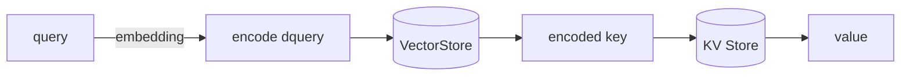
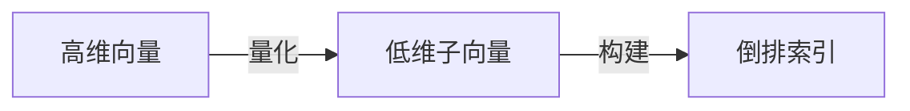
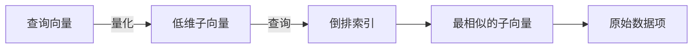
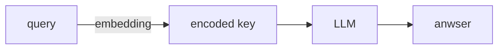

## RAG Methords


### 1. 知识预处理：  

知识源即各种数据、文档(json、pdf、txt...)，将其分割成**块（chunk）**，
使用**embedding算法**将每个**块**编码为词向量，
将词向量存储起来并建立索引以便快速查找。

#### 1.1 **embedding算法**
通常将高维数据映射到低维空间，以便更好地表示数据的特征使得可以使用语义相似度衡量句子的相似性。


数值相似的embedding在语义上也近似。

假设我们有一个序列 $x=[x_1,x_2,...,x_T]$ , 其中 
$T$ 是序列的长度,  $x_t$是序列中的第 $t$ 个元素。我们的目标是学习一个映射 $f$ ，将序列 $x$ 映射为一个固定大小的向量 v，即 $v=f(x)$。

单词的嵌入不是静态的，还取决于单词周围的上下文,因此我们使用BERT，
它能够动态的基于上下文计算语义值，还捕捉到文档的深层语义信息：$v=BERT(x)$


### 2. 向量存储和查询  

知识源有不同格式，我们基于不同格式选择存储方式，大致可分为两类：

#### 2.1 文档存储

几乎适用于存储所有的文档数据
```python
doc_store = DocStore()
model = EmbeddingModel()

for doc in docs：
    embedding = model.encode(doc)
    doc_store.add(embedding)
```

#### 2.2 Key-Value存储

适用于存储问答（QA）类型的数据，经实验验证：
仅仅将query编码成embedding，去查找一个问题（Q，也即key），再通过key查找对应的答案value。得到结果精度和速度都比直接查找$encode(key+value)$快。



```python
# 初始化 VectorStore 和 KVStore 对象
vector_store = VectorStore()
kv_store = KVStore()

# 对于每个查询
for query in queries:
    # 将查询转换为embedding
    encoded_query = encode_query(query)
    
    # 在 VectorStore 中查找最相似的向量
    similar_vectors = vector_store.find_similar(encoded_query)
    
    # 如果有相似的向量，则使用它作为编码的键
    if similar_vectors:
        encoded_key = similar_vectors[0]  # 假设第一个是最相似的
        
        # 在 KVStore 中查找与编码的键相关的值
        value = kv_store.get_value(encoded_key)
        
        # 返回值
        yield value
```

#### 2.3 查询

将文档转换成向量后可以通过两个向量的距离判断文档的语义相似度，有以下三种方法：

1. **L1距离（曼哈顿距离）**：
  L1距离是两点在标准坐标系上的绝对轴距总和。对于两个向量 $ \mathbf{x} $ 和 $ \mathbf{y} $:
     $$
     L1(\mathbf{x}, \mathbf{y}) = \sum_{i=1}^{n} |x_i - y_i|
     $$
1. **L2距离（欧几里得距离）**：
  L2距离是两点之间的最短距离，也就是直线距离。对于两个向量 $ \mathbf{x} $ 和 $ \mathbf{y} $:
     $$
     L2(\mathbf{x}, \mathbf{y}) = \sqrt{\sum_{i=1}^{n} (x_i - y_i)^2}
     $$
1. **余弦相似度**：
  余弦相似度是基于向量之间的夹角来衡量它们之间的相似性。对于两个向量 $ \mathbf{x} $ 和 $ \mathbf{y} $:
     $$
     \text{cosine similarity}(\mathbf{x}, \mathbf{y}) = \frac{\mathbf{x} \cdot \mathbf{y}}{\|\mathbf{x}\| \|\mathbf{y}\|}
     $$

其中：L1距离和L2距离都是衡量向量差异的度量，其中L1距离对异常值更敏感，而L2距离对异常值的影响较小。余弦相似度是衡量向量方向上相似度的度量，它不考虑向量的长度，只考虑它们之间的角度。


#### 2.4 索引

1. **Flat高准确率索引**
  引入查询向量 xq，并计算 xq 到每个向量的距离，在计算完所有这些距离后，我们将返回其中最接近的 k 个作为我们最接近的匹配项。即进行一次k最近邻 （kNN） 搜索。当搜索质量的优先级高于搜索速度且索引较小($\le 10k$)时，使用Flat索引。

1. **IVFFlat, Inverted File Flat 倒排文件索引** 
  倒排索引是一种数据结构，它存储了文档（或数据项）与其相关关键词（或向量）之间的关系。
  **向量量化**： 首先使用量化方法将高维向量数据集分解成多个低维子向量。这些子向量被进一步量化为有限的码本（codebook）中的离散值。
  **构建倒排索引**： 每个量化后的子向量都被存储在倒排索引中。在IVFFlat中，倒排索引是一个简单的平面文件，其中每个条目包含一个子向量的量化值和指向原始数据项的指针。这种结构使得可以根据子向量的量化值快速找到原始向量。
  **搜索**： 当进行相似性搜索时，查询向量也被量化。然后，使用倒排索引找到最相似的子向量，并进一步找到原始数据项。搜索结果可以基于原始数据项之间的余弦相似度或欧氏距离进行排序。






```py
# 构建倒排索引的函数
def build_inverted_index(documents):
    inverted_index = {}
    for doc_id, vector in documents:
        quantized_vector = quantize_vector(vector)
        inverted_index[quantized_vector] = inverted_index.get(quantized_vector, []) + [doc_id]
    return inverted_index

# 在倒排索引中搜索的函数
def search_inverted_index(inverted_index, query_vector):
    quantized_query = quantize_vector(query_vector)
    similar_vectors = sorted(inverted_index.keys(), key=lambda v: cosine_similarity(v, quantized_query), reverse=True)
    results = []
    for vector in similar_vectors:
        doc_ids = inverted_index.get(vector, [])
        for doc_id in doc_ids:
            results.append((doc_id, retrieve_document(doc_id)))
    return sorted(results, key=lambda x: cosine_similarity(query_vector, x[1]), reverse=True)

# 示例使用
documents = [('doc1', vector1), ('doc2', vector2), ...]
inverted_index = build_inverted_index(documents)

query = query_vector
search_results = search_inverted_index(inverted_index, query)

# 打印搜索结果
for doc_id, doc_content in search_results:
    print(f"Document ID: {doc_id}, Content: {doc_content}")

```

### 3. 查找

输入问题(query), 用embedding算法将query编码为词向量以便进行基于语义相似度的匹配，和知识源词向量(向量存储)匹配获取语义相似度最高的K个结果(TopK), 将TopK和query组合成prompt, 将prompt输入LLM获得响应

```py
def process_query(query, llm):
    # 将查询转换为嵌入向量
    embedding = embed_query(query)
    # 使用LLM生成与嵌入向量相关的编码键
    encoded_key = get_encoded_key(embedding, llm)
    # 使用LLM根据编码键检索值
    value = retrieve_value(encoded_key, llm)
    # 生成答案
    answer = generate_answer(value)
    return answer

# 示例使用
query = "口腔溃疡怎么治?"
llm = LargeLanguageModel()  # 假设这是一个已经初始化的LLM
# 处理查询并获取答案
answer = process_query(query, llm)    
```
